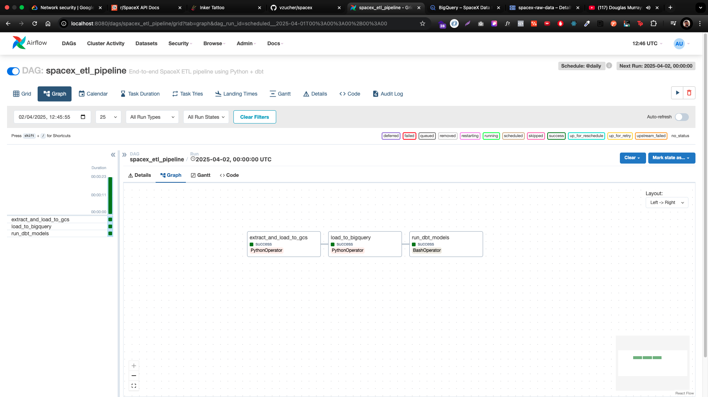
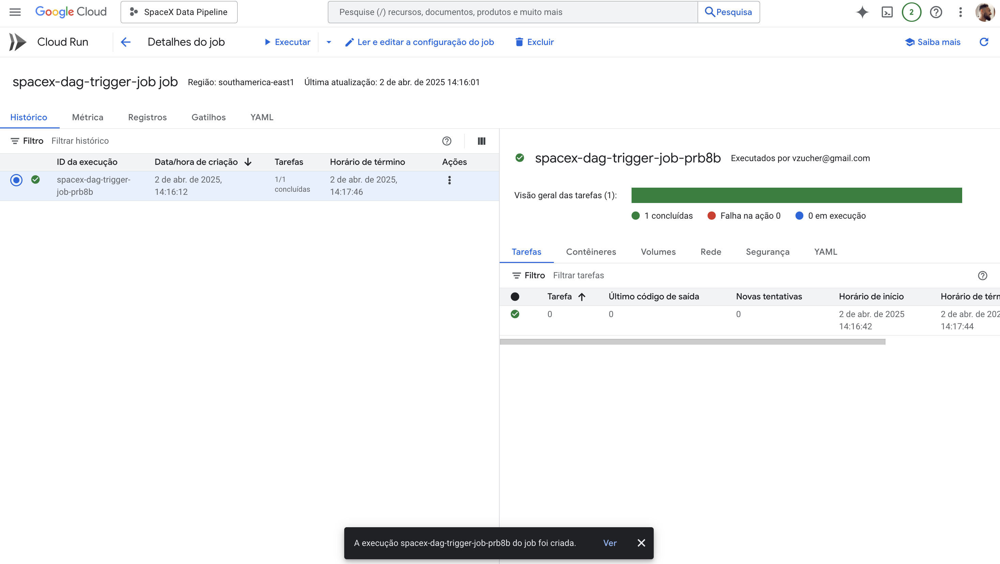

# 🚀 SpaceX ETL Pipeline 🌌

## TL;DR
This project extracts data from the SpaceX API, loads it into GCS, moves it to BigQuery, transforms it using dbt, and orchestrates everything with an Airflow DAG. The entire pipeline is containerized with Docker (and Docker Compose for local development), deployed as a Cloud Run Job (built for linux/amd64), and scheduled daily via Cloud Scheduler. Secrets and service account keys are securely managed in GCP Secrets Manager.

---

# Airflow Web UI



## GCP Cloud Run Job Scheduler 



## 🛠️ Tech Stack Summary
- **Languages & Tools:** Python, dbt, Docker, Airflow
- **Data Extraction:** SpaceX API
- **Storage & Data Warehouse:** Google Cloud Storage (GCS) & BigQuery
- **Transformation:** dbt (Medallion architecture: raw → staging → mart)
- **Orchestration:** Apache Airflow
- **Containerization:** Docker & Docker Compose
- **Deployment:** Cloud Run Job (via Artifact Registry) & Cloud Scheduler
- **Secrets Management:** GCP Secrets Manager

---

## 📊 Architecture Overview

### 1. SpaceX API 🚀
- **What:** Public API providing SpaceX launch and mission data.
- **Role:** Source of raw data for the pipeline.

### 2. Data Extraction Scripts 📥
- **What:** Python scripts that fetch data from the SpaceX API.
- **Role:** Extract data and upload it to Google Cloud Storage (GCS) for staging.

### 3. Data Loading Scripts 🚚
- **What:** Python script to transfer data from GCS to BigQuery.
- **Role:** Populate BigQuery with raw data for further processing.

### 4. Data Transformation with dbt 🧹
- **What:** dbt project that transforms raw tables in BigQuery into refined layers.
- **Role:** Create medallion layers (raw → staging (materialized views) → mart) for analysis.

### 5. Pipeline Orchestration with Airflow ⏱️
- **What:** Airflow DAG that orchestrates extraction, loading, and transformation.
- **Role:** Automate and monitor the execution of the entire pipeline.

### 6. Local Development with Docker Compose 🐳
- **What:** Docker Compose configuration for running a local Airflow instance.
- **Role:** Simplify development and testing of the pipeline.

### 7. Containerization & Deployment 🚢
- **What:** Docker image built from the project.
- **Role:** Deployed to Artifact Registry (or GCR) for execution in the cloud.
- **Note:** The image is built for the `linux/amd64` platform to be compatible with Cloud Run.

### 8. Service Account & GCP Secrets 🔑
- **What:** Service account key stored in GCP Secrets Manager.
- **Role:** Securely enable interaction between Cloud Run, GCR, BigQuery, and GCS.

### 9. Cloud Run Job for Daily Execution ☁️
- **What:** Cloud Run Job that executes the containerized pipeline.
- **Role:** Trigger the Airflow DAG on-demand and exit once complete, ensuring cost-efficient, serverless execution.

### 10. Scheduling with Cloud Scheduler ⏰
- **What:** Cloud Scheduler job that sends an HTTP POST to trigger the Cloud Run Job.
- **Role:** Automate the daily execution of the pipeline.

### 11. Entrypoint Script (`entrypoint.sh`) 🔄
- **What:** Shell script that initializes the Airflow database, forces a scheduler run to parse DAGs, unpauses and triggers the DAG, and finally starts the scheduler for a short period.
- **Role:** Ensures that each container execution fully sets up and runs the pipeline before exiting.

---

## 🚀 Deployment Instructions

### Local Development

1. **Clone the Repository:**
   ```bash
   git clone https://github.com/vzucher/spacex.git
   cd spacex
